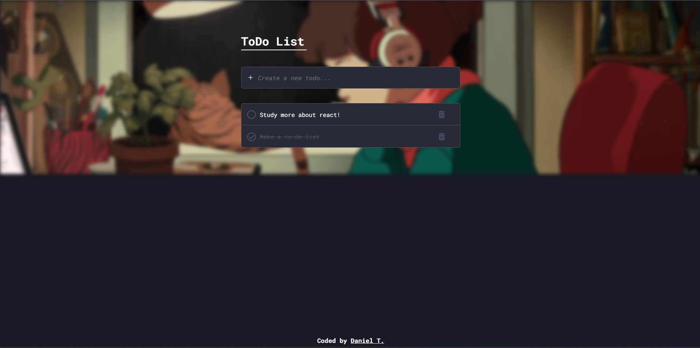

  <h1>Todo List + vite + styled-components!</h1>

## 📱 Layout

  

## ✔️ Técnicas e tecnologias utilizadas

Lista de tecnologias que foram usadas nesse projeto:

 

### Frontend

## 🛠️ Abrir e rodar o projeto

Para abrir e rodar o projeto, entre na pasta web do frontend execute `npm install` para instalar as dependências e `npm run dev` para iniciar o projeto.

Depois, acesse <a href="http://localhost:5173/">http://localhost:5173/</a> no seu navegador.

## 📚 Mais informações

Entre em contato pelo [linkedin](https://www.linkedin.com/in/daniel-tinois-7338a2244/).

  <small>Daniel T. - 2024</small>

